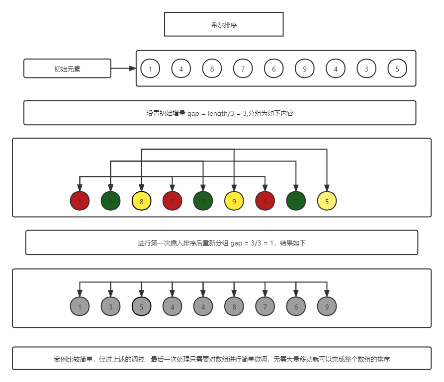

# 算法 4.0

## 1. 排序算法

> 算法的实现效率取决于比较的次数
> 大部分的增长数量级都是线性对数或者平方级别
>
### 1.1 初级排序算法

#### 1.1.1 选择排序

1. 找到数组中最小的那个元素
2. 将它和数组中的第一个元素交换位置
3. 再次，在剩下的元素中找到最小的元素

#### 1.1.2 插入排序

将其余所有元素都在插入之前向右移动一位

如果数组中倒置的数量小于数据大小的某个倍数，我们说这个数据是部分有序的
典型的部分有序的数据：
 数组中的每个元素距离它的最终位置都不远
 一个有序的大数组接一个小数组
 数组中之后几个元素的位置不正确

平均：比较次数：(N^2)/4  交换次数：(N^2)/4
最坏：比较次数：(N^2)/2  交换次数：(N^2)/2
最好：比较次数：N-1      交换次数：0

***改进，将较大的元素都向右移动而不总是交换两个元素***

#### 1.1.3 希尔排序

> 希尔排序 - 一种基于插入排序的快速排序算法，也称为 `缩小增量排序`

> 希尔排序是把记录按下标的一定增量分组，对每组使用直接插入排序算法排序；随着增量逐渐减少，每组包含的关键词越来越多，当增量减至1时，整个文件恰被分成一组，算法便终止。

交换不相邻的元素以对数组的局部进行排序，并最终用插入排序将局部有序的数组排序，**任意间隔为 h 的元素都是有序的**

希尔排序是唯一无法准确描述其对于乱序的数组的性能特征的排序方法

注意：着重在于任意间隔有序以及增量分组

### 1.2 归并排序

### 1.3 快速排序

### 1.4 优先队列

### 1.5 总结

## 2. 查找

### 2.1 符号表
### 2.2 二叉查找树
### 2.3 平衡查找树
### 2.4 散列表
### 2.5 总结

## 3. 图
### 3.1 无向图
### 3.2 有向图
### 3.3 最小生成树
### 3.4 最短路径

## 4. 字符串
### 4.1 字符串排序
### 4.2 单词查找树
### 4.3 子字符换查找
### 4.4 正则表达式
### 4.5 数据压缩
